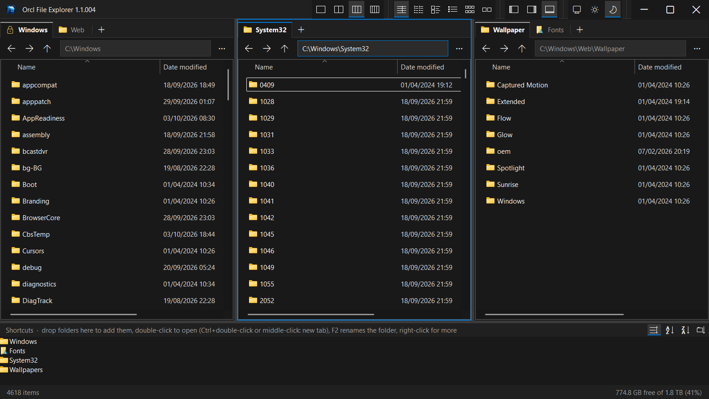

# Orcl File Explorer

A light multi-pane file manager for Windows, in the spirit of xplorer2, made for wide and ultrawide
screens. Every pane hosts the **real Windows Explorer view**, so thumbnails, right-click menus,
drag and drop, renaming, columns and shell extensions behave exactly as in File Explorer.



**[Download the latest release](https://github.com/Oracooll/orcl-file-explorer/releases/latest)**:
a single `orclfx.exe`, no installer package and no admin rights needed.

## Features

**Panes and tabs**
- One to four panes side by side (Alt+1 … Alt+4). Each pane has its own tabs, remembered between
  sessions; panes you hide keep their tabs for when you show them again.
- Locked tabs (right-click a tab › Lock) never leave their folder: opening a folder from one opens
  it in a new tab.
- The active pane, the one you used last, is framed in your accent colour. The first click on an
  inactive pane only activates it.
- Double-click empty space in a file list to go up one level.
- Drag a divider to resize: only that divider moves, and the panes to its right share the change
  equally. Double-click a divider to make all panes the same width.

**Side panes** (title bar or Alt+T / Alt+P / Alt+S)
- **Tree**: one folder tree that follows the active pane.
- **Preview**: previews the active pane's selected file with the Windows preview handlers
  (PDF, Office, images, text …). Handlers run outside the app, as in File Explorer; files without an out-of-process handler show a thumbnail.
- **Shortcuts**: a strip of favourite folders. Drop folders onto it, double-click to open
  (Ctrl+double-click or middle-click for a new tab), F2 renames the real folder, sort icons on its
  header. The list is stored in your OneDrive, so all your computers share it; shortcuts to folders
  that don't exist on the current computer are dimmed and listed in a warning line.

**Find** (magnifier in the title bar, Ctrl+F or F3)
- Searches the folder open in the active pane and all its subfolders, and shows the results in a new
  tab of that pane, in the real Explorer list: open, right-click, preview and sort them as usual, with
  a Folder path column showing where each one is. Double-clicking a folder in the results opens it in
  that tab; Back or Up returns to the searched folder.
- Type part of a name (`report`), or patterns such as `*.pdf;*.docx`; folders that match are found
  too. The app's own search runs in the background, works everywhere (also in folders Windows doesn't
  index and on network drives), shows results as they come and can be stopped; it doesn't follow
  folder links, so nothing is found twice.
- **Also search inside files** hands the search to Windows Search, like File Explorer's search box:
  it finds words inside documents (Office, PDF, text …) in folders Windows indexes, and understands
  filters such as `kind:music`, `size:>10MB` or `date:this week`.
- Recent searches are remembered.

**View**
- View modes in the title bar (Details, List, Tiles, Content, Medium and Large icons), all eight
  in ☰ › View mode.
- Light, dark or match-Windows theme from the title bar.
- ☰ › View options: show hidden files (Ctrl+H), auto-fit the Name column, natural number sorting,
  and folder sizes. Folder sizes are calculated in the background at low priority, skip network
  drives, never download OneDrive files, and turn themselves off if a scan gets out of hand.

## Keyboard shortcuts

| Keys | Action |
|---|---|
| Double-click empty space, Backspace, Alt+Up | Up one level |
| Alt+Left / Alt+Right | Back / Forward |
| Tab | Next pane |
| Ctrl+F, F3 | Find in this folder and its subfolders |
| Ctrl+T / Ctrl+W | New tab / close tab (middle-click a tab also closes it) |
| Ctrl+Tab / Ctrl+Shift+Tab | Next / previous tab |
| Ctrl+L, Alt+D, F4 | Edit the address |
| Alt+1 … Alt+4 | One to four panes |
| Alt+T / Alt+P / Alt+S | Tree / Preview / Shortcuts pane |
| Ctrl+H | Show or hide hidden files |

## Install

1. Download `orclfx.exe` from the [releases page](https://github.com/Oracooll/orcl-file-explorer/releases/latest).
2. Run it and choose **Yes** to install for your Windows account. It goes to
   `%LOCALAPPDATA%\Programs\Orcl File Explorer`, appears in the Start menu, and can be removed from
   Settings › Apps.
3. Optional: right-click its taskbar icon › Pin to taskbar.

Once the [winget listing](https://github.com/microsoft/winget-pkgs/pull/446536) is approved, it can also be
installed with `winget install Oracooll.OrclFileExplorer` (and updated with `winget upgrade`).

**Updates:** the main menu (click the app icon at the top left, or the menu button in a pane) has
**Check for updates…**. It finds the newest release here on GitHub, checks the download (size,
SHA-256 checksum and version), saves your tabs, replaces the program and restarts it. Once a day the
app also checks by itself and shows a note in the status bar when a new version is out (it never
installs without asking; turn this off with **Check for updates automatically** in the menu).
Running a newer `orclfx.exe` by hand (or `orclfx.exe --install`) updates the installed copy too.
`orclfx.exe --portable` runs it without installing. `orclfx.exe --install --quiet` and
`orclfx.exe --uninstall --quiet` install or remove it without any windows (the exit code says whether it
worked); a quiet uninstall keeps your settings.

Windows SmartScreen may warn about a downloaded unsigned program: choose **More info › Run anyway**.
That's only needed once: installing (and updating) removes the browser's "downloaded from the internet"
mark from the installed program, so Windows doesn't ask "The publisher could not be verified" on every start.

**Requirements:** Windows 10 or 11 with .NET Framework 4.8, which Windows includes.

## Build from source

No SDK or IDE needed: the build uses the C# compiler that ships with Windows (.NET Framework 4.x).

```
powershell -ExecutionPolicy Bypass -File build.ps1
```

This produces `dist\orclfx.exe`. The icon is generated from `Icon.png` by `src\make-icon.ps1`.

The code is C# 5 with Windows Forms and the Shell COM interfaces, in [`src/`](src):

| Folder | What's in it |
| --- | --- |
| `src/` | `Program.cs` (startup), `MainForm.cs` (main window), `Installer.cs`, `AssemblyInfo.cs` (version) |
| `src/Core/` | Logic with no UI: shortcut-list merging, pane widths, the settings file, folder sizes, path and file helpers |
| `src/Panes/` | Explorer tabs, file panes, tree, preview and shortcuts panes |
| `src/UI/` | Title bar, tab strip, theme colours, splitters and other controls |
| `src/Interop/` | Windows API and Shell COM declarations |

### Tests

```
powershell -ExecutionPolicy Bypass -File test.ps1
```

Builds the app and the tests in `tests/` into `dist\tests\` and runs them. The tests cover the
`src/Core` logic and the preview worker. They need no extra packages and open no windows. Add `-Smoke` to also start the app
with throw-away settings and check that it opens, saves its settings and closes cleanly. GitHub runs
the tests on every push.

## Where things are stored

| What | Where |
|---|---|
| Tabs, layout and settings | `%APPDATA%\DualPane\state.txt` (with a `.bak` copy) |
| Shared shortcuts list | `%OneDrive%\DualPane\shortcuts.txt` |
| Error log | `%APPDATA%\DualPane\errors.log` |

(The folders keep the project's original name, DualPane, so earlier installs carry over.)

## Notes

- Switching between light and dark restarts the window, keeping your tabs and layout, because
  Windows applies some light/dark choices only when an app starts.
- Only one window runs at a time; launching the app again brings the open window to the front.
- See [CHANGELOG.md](CHANGELOG.md) for the version history. Versions are `major.minor.build` with a
  three-digit build (1.1.014).

## License

[PolyForm Noncommercial 1.0.0](LICENSE.md): free to use, modify and share for any noncommercial
purpose (personal use, study, hobby projects, charities, schools, public bodies). Selling it or
using it to make money is not permitted. Because it restricts commercial use, this is
source-available software rather than "open source" in the OSI sense.
